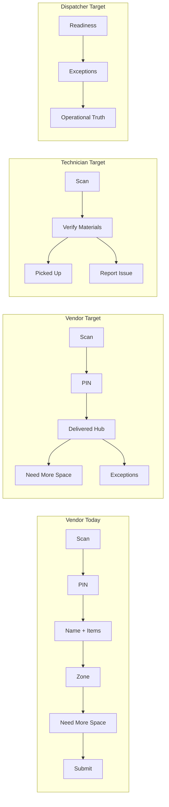

# Exception-Only Vendor Flow — Product Design Review

> **Type:** Product design + implementation reference  
> **Date:** 2026-06-08 (Slice 2 shipped 2026-06-11)  
> **Status:** Slice 2 shipped — single vendor UI at `/#/receive`  
> **Product authority:** `PROJECT_STATUS/svscope_simple.md` §4 (Vendor Delivery Actions) — scope wins on conflict; this doc is the phased implementation reference.  
> **Canonical path:** `docs/product-review/exception-only-vendor-flow.md` (no duplicate at `docs/` root).  
> **Product principle:** *The person entering data must receive value from entering the data.*

---

## 1. Executive Summary

StageVerify today asks vendors to perform **line-item verification** at the dock — checking off quantities, adjusting damaged counts, assigning zones, and submitting a partial/complete check-in. That work benefits the dispatcher and technician, but offers **little immediate value to the driver**, who is under time pressure and often lacks visibility into PO line details.

This review proposes a migration toward **exception-only vendor delivery**:

| Actor | Target flow |
| ----- | ----------- |
| **Vendor** | Scan → PIN → **Delivered** (under 30 seconds for normal deliveries) |
| **Technician** | Scan → **Verify Materials** → Picked Up **or** Report Issue |
| **Dispatcher** | Owns readiness, exceptions, and final operational truth |

**Need More Space remains first-class.** It is one of the few vendor actions that directly benefits the driver (avoids re-delivery, reduces dispatcher phone calls, secures overflow staging). It must stay highly visible on mobile — never buried in menus.

The migration is **phased and reversible**. Existing `DeliveryStatus` values and Firestore documents remain valid throughout; new behavior ships behind feature flags before becoming default.

**Recommendation:** Slice 2 **shipped** (2026-06-11). Default `vendorDeliveryMode` remains `full_checkin` until Slice 3 technician verification is ready; set `exception_only` in Settings or demo scripts for Delivered hub.

---

## 2. Current State Analysis

### Vendor workflow — dual mode on one page

**Routes (canonical):** `/#/receive` (`ReceivingPage`) — **only** vendor check-in UI. Legacy `/#/`, `/#/checkin/:id`, and compact `#/r?` rewrite to receive. Demo QR: `/#/demo/vendor-scan`.

**Modes (`appSettings.vendorDeliveryMode`):** `exception_only` → Scan → PIN → **Delivered hub** (canonical product intent per svscope §4; no item counting). `full_checkin` → legacy line-item flow on the same page. **Default in Firestore seed / Settings:** `full_checkin` until Slice 3 technician verification is ready to absorb truth transfer; set `exception_only` in Settings or demo scripts for the Delivered hub.

The table below describes the **legacy `full_checkin`** path still available behind the flag:

| Step | What happens | Data written | Driver value |
| ---- | ------------ | ------------ | ------------ |
| 1. Scan QR | Deep link resolves delivery / zone | May transition `pending` → `arrived` | Low — finds the right order |
| 2. PIN gate | `verifyVendorPin` CF; 15-min session | `pinVerificationEvents` audit | Medium — proves identity |
| 3. Driver name | Required text field | Used in `statusHistory.actorName` | Low |
| 4. Item checkoff | Per-line delivered/missing/damaged qty | `items.*`, derives `partial` or `ready_for_pickup` | **Negative** — time-consuming, error-prone |
| 5. Zone assignment | Pick staging spot or Skip | `stagingLocationId` | Medium when zones are full |
| 6. Need More Space | Tiered overflow spot suggestions | `additionalStagingLocationIds` | **High** — solves real dock pain |
| 7. Submit check-in | Confirmation modal | `deliveries.status`, `submittedAt`, item qty fields | Low — mostly benefits office |
| 8. Done + revert | 60-min vendor revert window | `revertDeliveryStatus` | Medium — mistake recovery |

**Typical happy-path time:** 2–5+ minutes (item list + zone + confirm).  
**E2E coverage:** `verify:vendor-e2e` (10 checks including PIN, partial qty, Need More Space, dispatcher drawer).

**Pain points:**
- Vendor is asked to be the **system of record** for material accuracy before anyone inside the shop has verified.
- Partial/damaged counts at vendor time create **premature truth** that technicians may contradict later.
- Driver name + per-item UI dominate screen time; Need More Space is visible but **competes** with mandatory checkoff steps.

### Technician workflow (today)

**Route:** `/#/pickup` (PickupPortalPage) — public, no Firebase Auth

| Step | What happens | Data written | Technician value |
| ---- | ------------ | -------------- | ---------------- |
| 1. Open pickup (QR / link) | Loads job deliveries via `loadPickupReadyDeliveriesPublic` | Read-only | High — finds materials |
| 2. Location display | Pickup at / Also check / Find it at / Shop stock (Slice 2) | Read-only | High |
| 3. Pick-list checkoff | Tap rows to confirm each item / shop-stock line | Local UI state | Medium |
| 4. Report Issue (optional) | Modal → `createMaterialIssue` CF | `materialIssues`, `openIssueCount` | High — flags problems |
| 5. Done | `recordPickupEvent` | `pickupEvents`, `status` → `picked_up` | High |

**Gaps vs target:**
- No structured **per-item verification** (received vs expected, damaged, wrong item) before pickup.
- Report Issue exists but is **optional** and warning-only (Done not hard-blocked).
- Technician does not yet "own" the canonical item-level receipt state — vendor-submitted qtys are assumed.

### Dispatcher workflow (today)

**Route:** `/#/dispatcher` (auth-gated)

| Capability | Role today |
| ---------- | ---------- |
| Delivery list + search | Operational overview |
| Detail drawer | Status changes, staging, shop stock, PO, revert |
| Material Issues panel | Read-only list; open-issue badge (Slice 1) |
| Zone management | CRUD staging locations, occupancy |
| Settings | Revert window, auto-submit timer |
| Vendors | CRUD + PIN management |

**Status labels (UI):** Ordered → Shipped → Received → Partial / Staged → Picked Up → Installed  
**V2 readiness (derived):** Ordering → Not Ready → Ready For Pickup → Picked Up

Dispatcher currently **inherits vendor-submitted partial/complete** as readiness signal. Exception resolution UI (Phase 4) is not started.

---

## 3. Proposed State Analysis

### Vendor (target)

**Required path (< 30 seconds):**

```
Scan QR → Enter PIN → Tap "Delivered"
```

| Action | Required? | Placement | Outcome |
| ------ | --------- | --------- | ------- |
| Scan QR | Yes | Entry | Resolve delivery |
| Enter PIN | Yes | Gate | Session + audit |
| Tap **Delivered** | Yes | Primary CTA (full-width, sticky) | `status` → `delivered` (new or mapped), `deliveredAt`, optional `stagingLocationId` if pre-assigned |
| **Need More Space** | No — **prominent** | Same screen as Delivered (secondary row, not hamburger) | `additionalStagingLocationIds` — unchanged logic |
| Wrong Location | No — prominent | Exception chip | `materialIssue` or `vendorException` note; flags dispatcher |
| Damaged Items | No — prominent | Exception chip | Quick count or photo stub; full detail deferred |
| Missing Items | No — **only if obvious** | Exception chip | "Obviously not on truck" shortcut; no full line audit |

**Removed from happy path (not deleted — moved to exceptions or technician):**
- Driver name (default to "Vendor Driver" or PIN session identity)
- Per-item checkoff list on normal delivery
- Submit confirmation modal for all-complete path
- Zone picker as mandatory step (zone can remain pre-assigned by dispatcher or chosen only via Need More Space / Wrong Location)

**Need More Space — design constraints (non-negotiable):**
- Visible on the **Delivered** screen without scrolling on standard mobile viewports
- Label remains **"Need More Space?"** (proven in E2E)
- Same tiered recommendation UX (shelf → ground → oversized)
- Treated as **first-class exception workflow**, not advanced settings

### Technician (target — primary verification actor)

```
Scan → Verify Materials → Picked Up
                    ↘ Report Issue
```

| Step | Purpose | Canonical data |
| ---- | ------- | -------------- |
| Scan (job/zone QR) | Route to correct pickup context | Read delivery + items |
| **Verify Materials** | Line-by-line: present / missing / damaged / wrong | `items.qtyReceived`, `items.status`, `availabilityStatus` per line |
| Shop stock pull | Confirm shop-stock lines pulled | Structured pick-list state (Phase 3 remainder) |
| Report Issue | Blocking or warning by issue type | `materialIssues` (existing CF) |
| Picked Up | Confirms physical custody transfer | `pickupEvents`, `status` → `picked_up` |

**Ownership shift:** Technician verification **overwrites or confirms** vendor-delivered state. Vendor "Delivered" means *"I dropped material at the facility"* — not *"every line matches the PO."*

### Dispatcher (target — readiness + exceptions)

| Responsibility | Proposed behavior |
| -------------- | ----------------- |
| **Readiness ownership** | Dispatcher (or material owner) sets when a job/package is **Ready For Pickup** — not inferred from vendor line-item counts |
| **Exception resolution** | Triage vendor exceptions + technician issues in unified queue (Phase 4) |
| **Operational truth** | Dashboard shows: Delivered → Verified → Ready → Picked Up pipeline |
| **Vendor accountability** | PIN audit + exception log; not qty accuracy at dock |
| **Zone/staging** | Pre-assign zones; Need More Space overflow visible in drawer |

---

## 4. Adoption Benefits

| Stakeholder | Benefit |
| ----------- | ------- |
| **Vendor driver** | Sub-30-second normal delivery; immediate value from Need More Space and exception shortcuts |
| **Technician** | Clear mandate to verify; aligns with physical inspection at pickup |
| **Dispatcher** | Fewer garbage partial states; exceptions are **signal**, not noise |
| **Office / material owner** | Readiness decoupled from vendor data entry quality |
| **StageVerify adoption** | Lower friction at the door → higher scan/PIN completion rates |

---

## 5. Data Quality Benefits

| Today | Proposed |
| ----- | -------- |
| Vendor guesses qtys under pressure | Technician verifies against physical material |
| `partial` at vendor time may be wrong | `partial` emerges from technician verification or explicit issues |
| Damaged counts at dock often incomplete | Damaged reported at verification (better context) |
| Driver name required but rarely used | PIN session + optional exception notes |
| Multiple writers to item qty without priority | **Technician verification wins**; vendor exceptions are flags only |

**Net:** Higher **accuracy** at the point of physical custody (technician), lower **false precision** at the point of drop-off (vendor).

---

## 6. Risks and Tradeoffs

| Risk | Severity | Mitigation |
| ---- | -------- | ---------- |
| Vendor marks Delivered but material not actually dropped | Medium | PIN audit; dispatcher Delivered queue; revert window (short) |
| Technician skips verification | Medium | UX defaults to verify screen; open issues block or warn on Done |
| Dispatcher readiness bottleneck | Medium | Auto-ready rules for trusted vendors/jobs (later); material owner field (exists in models) |
| Status migration confusion | Medium | Slice 1 label mapping + dual-display period |
| Need More Space de-prioritized in redesign | **High if allowed** | **Explicit design constraint — never demote** |
| QR routing breaks on new statuses | High | Update `RECEIVE_BLOCKED`, `ZONE_CLEARED`, `scanRouting.ts` in Slice 1 plan |
| Shops that relied on vendor qty for staging decisions | Medium | Dispatcher pre-assigns zone; Delivered ≠ Staged |
| Regression in vendor E2E | Medium | Parallel E2E script for exception-only path |

**Tradeoff accepted:** Vendor flow optimizes **speed and driver value** at the cost of **immediate line-item precision** — precision moves to technician.

---

## 7. Status Model Impact

### Preferred lifecycle wording (target vocabulary)

| Business term | Meaning | Proposed mapping |
| ------------- | ------- | ---------------- |
| **PO Sent** | Order placed with vendor | `pending` (label: "PO Sent") |
| **Vendor Confirmed** | Vendor acknowledged shipment | `shipped` (label: "Vendor Confirmed") |
| **Delivered** | Driver dropped material at facility | New or remap: `arrived` → label **"Delivered"**; add `deliveredAt` timestamp |
| **Picked Up** | Technician confirmed custody | `picked_up` (unchanged) |

### Statuses to retain internally (compatibility)

Keep existing `DeliveryStatus` enum values during migration. Avoid breaking Firestore documents or QR routing.

| Internal status | Role during migration | Long-term |
| --------------- | --------------------- | --------- |
| `pending` | PO Sent | Keep |
| `shipped` | Vendor Confirmed | Keep |
| `arrived` | **Delivered** (vendor tap) | Keep value; change label |
| `partial` | Set by **technician verification**, not vendor | Writer changes |
| `ready_for_pickup` | **Dispatcher readiness** gate | Decouple from vendor submit |
| `complete` | All lines verified ready | Technician/dispatcher |
| `issue` | Blocking exception | Dispatcher + issues |
| `picked_up` | Picked Up | Keep |
| `installed` | Post-pickup (existing) | Keep |

### V2 `readinessStatus` alignment

| Readiness | When set |
| --------- | -------- |
| `ordering` | PO Sent / Vendor Confirmed |
| `not_ready` | Delivered but not verified or not dispatcher-ready |
| `ready_for_pickup` | Dispatcher (or auto-rule) after technician verification |
| `picked_up` | Technician Done |

Use `effectiveReadinessStatus()` — already derives from `status` when `readinessStatus` unset.

---

## 8. Firestore / Data Model Impact

**No changes in this document.** Planned impacts for implementation slices:

| Area | Change | Slice |
| ---- | ------ | ----- |
| `deliveries` | `deliveredAt` (optional ISO), `vendorDeliveryMode: 'full_checkin' \| 'exception_only'` | 2 |
| `deliveries` | `readinessStatus` written by dispatcher (not vendor submit) | 4 |
| `items` | Qty fields written primarily on technician verify, not vendor Delivered | 3 |
| `materialIssues` | Vendor exception chips may create issues (type: damaged, missing, other) | 2 |
| `statusHistory` | New event: vendor `Delivered`; technician `Verified` | 2–3 |
| `pinVerificationEvents` | Unchanged | — |
| `additionalStagingLocationIds` | Unchanged (Need More Space) | — |
| Client write path | `markVendorDelivered` in `firestoreService` (status `arrived`, `submittedAt`; no item qty on happy path) | 2 ✅ |
| Firestore rules | **No rules change** — reuses existing unauth delivery + `statusHistory` fields | 2 ✅ |

**Backward compatibility:** Existing deliveries with vendor-submitted item qtys remain valid. Technician verify can **confirm** or **correct** without migration.

---

## 9. UI/UX Impact

### Vendor (`ReceivingPage` only)

| Screen | `full_checkin` (legacy default) | `exception_only` (shipped hub) |
| ------ | ------------------------------- | ------------------------------ |
| After PIN | Name → item list → zone → submit | **Delivered** hub (`VendorDeliveredHub`) |
| Primary CTA | Submit Check-in | **DELIVERED** (sticky bottom) |
| Secondary | Need More Space (on zone step) | **Need More Space?** + **Issue** modal (Wrong Location / Damaged / Missing / Other) |
| Item list | Full-screen mandatory | Hidden on happy path |
| Done | Check-in Complete + revert | Delivered confirmation + short revert |

### Technician (`PickupPortalPage`)

| Screen | Today | Proposed |
| ------ | ----- | -------- |
| Entry | Pick list for ready deliveries | **Verify Materials** step before Done |
| Items | Tap-to-check pick list | Per-line: ✓ / missing / damaged / wrong |
| Issues | Report Issue modal | Integrated into verify + standalone |
| Done | All Items Picked Up | Requires verify completion (or explicit override) |

### Dispatcher (`DispatcherDashboardPage`)

| Area | Today | Proposed |
| ---- | ----- | -------- |
| Status chips | Ordered / Received / Partial / Staged | PO Sent / Vendor Confirmed / **Delivered** / Verified / Ready |
| List columns | itemsReceivedLabel from vendor | **Verification** column (technician-owned) |
| Drawer | Status actions + issues read-only | Readiness toggle + exception queue |
| Filters | By status | + "Awaiting verification", "Vendor exceptions" |

---

## 10. E2E Test Impact

| Script | Today | After migration |
| ------ | ----- | --------------- |
| `verify:vendor-e2e` | PIN, partial qty, Need More Space, dispatcher partial | **Split:** legacy script kept until flag removal; new `verify:vendor-delivered` for Scan→PIN→Delivered + Need More Space |
| `verify:pickup` | Scenarios A + B (issue + pickup) | Add **verify step** assertions; technician qty confirmation |
| `verify:vendor-pin` | PIN gate only | Unchanged |
| Prod variants (`:prod`) | Required after deploy | Both paths during dual-mode period |

**Need More Space** must remain in vendor E2E for both legacy and exception-only scripts.

---

## 11. Rollback Strategy

| Level | Trigger | Action |
| ----- | ------- | ------ |
| **Feature flag** | Exception-only UX confusion or drop in completion rate | `appSettings.vendorDeliveryMode = 'full_checkin'` restores current UI |
| **Per-vendor flag** | One vendor not ready | `vendors.exceptionOnlyEnabled` (proposed) |
| **Deploy rollback** | gh-pages regression | Redeploy prior commit; no data migration needed |
| **Data** | No destructive migration in Slices 1–2 | Old documents work with both UIs |
| **Rules rollback** | New Delivered write path misconfigured | Redeploy prior `firestore.rules`; flag off |

**Monitoring:** Track vendor session duration, Delivered completion rate, technician verify rate, open issues per delivery, Need More Space usage (should **not** drop).

---

## 12. Recommendation

**Slice 2 is shipped** (2026-06-11). Exception-only vendor UX is live behind `vendorDeliveryMode = 'exception_only'`. **Do not default the flag to `exception_only`** until Slice 3 technician verification can own item-level truth.

**Remaining priority order:**
1. Slice 1 label alignment — ongoing where UI copy still says "Received" vs **Delivered**  
2. Slice 3 technician verification — **gate before flipping default** off `full_checkin`  
3. Slice 4 dispatcher readiness + exception queue — completes the ownership model  

**Do not:** Remove Need More Space, hide it in menus, or fold it into dispatcher-only tools. Vendor must not count items or enter quantities in the canonical `exception_only` path (svscope §4).

---

## Implementation Planning — Phased Slices

### Slice 1: Status wording and lifecycle cleanup

**Goal:** Align UI labels and docs with PO Sent → Vendor Confirmed → Delivered → Picked Up without changing write paths.

| Deliverable | Detail |
| ----------- | ------ |
| Label map | Update `DELIVERY_STATUS_LABEL` display strings; dispatcher + portals |
| Docs | `project_state.md`, training one-pager |
| QR routing audit | Confirm `RECEIVE_BLOCKED` / `ZONE_CLEARED` still correct |
| Readiness copy | Surface `effectiveReadinessStatus` labels consistently |

**Risk:** Low. **Rollback:** Revert label constants.  
**Gate:** Build + existing E2E unchanged.

---

### Slice 2: Exception-only vendor flow (feature flag) — ✅ SHIPPED 2026-06-11

**Goal:** `Scan → PIN → Delivered` with prominent Need More Space + exception chips.

| Deliverable | Detail |
| ----------- | ------ |
| Feature flag | `appSettings.vendorDeliveryMode` in Settings + `appSettings/config` |
| Single vendor UI | `ReceivingPage` only; `App.tsx` / `CheckInPage` removed; legacy routes redirect |
| Delivered hub | `VendorDeliveredHub` — DELIVERED CTA + Need More Space + Issue modal |
| Write path | `markVendorDelivered` (status `arrived`, `submittedAt`; no item qty on happy path) |
| Legacy path | Full check-in in same page when `vendorDeliveryMode = full_checkin` |
| E2E | `npm run verify:vendor-delivered` + legacy `verify:vendor-e2e` |
| Rules | No rules change — existing unauth delivery/statusHistory fields |

**Risk:** Medium. **Gate:** Both E2E scripts pass; Need More Space visible in Delivered hub.

#### Future: email intelligence (document only — not implemented)

StageVerify may later monitor vendor email responses (dispatcher CC: `stageverifybot@gmail.com`) to infer readiness: complete order, partial shipment, backorder, delay. Future automation may set `ready_for_pickup`, update dispatcher dashboard, and E-tags. **Technician verification and dispatcher confirmation remain the operational truth until that ships.**

---

### Slice 3: Enhanced technician verification

**Goal:** Technician becomes primary source of truth for item-level accuracy.

| Deliverable | Detail |
| ----------- | ------ |
| Verify Materials screen | Per-line present / missing / damaged / wrong |
| Write path | Item qty + status on verify; supersedes vendor-era values |
| Pickup gate | Done requires verify (or explicit dispatcher override) |
| Report Issue | Tie issues to verify step |
| E2E | Extend `verify:pickup` with verify assertions |

**Risk:** Medium–high (public write paths).  
**Gate:** Pickup E2E + security review on new item write semantics.

---

### Slice 4: Dispatcher readiness and exception controls

**Goal:** Dispatcher owns readiness and exception resolution.

| Deliverable | Detail |
| ----------- | ------ |
| Readiness toggle | Set `readinessStatus` / `ready_for_pickup` explicitly |
| Exception queue | Unified vendor exceptions + technician issues |
| Dashboard columns | Verification %, awaiting verify, open exceptions |
| Reporting | Export / filter by lifecycle stage |
| Phase 4 prep | Issue resolution actions (assign, resolve, close) |

**Risk:** Medium. **Depends on:** Slices 2–3 data shapes.  
**Gate:** Dispatcher Playwright script; material owner workflow review with Dan.

---

## Appendix: Current vs Target Flow Diagram



---

## References

- `src/ReceivingPage.tsx` — canonical vendor check-in (exception-only + legacy flag)  
- `src/VendorDeliveredHub.tsx` — exception-only Delivered hub  
- `src/NeedMoreSpaceButton.tsx` — overflow staging workflow (legacy full_checkin done screen)  
- `src/PickupPortalPage.tsx` — technician pickup + Report Issue  
- `src/dispatcher/models.ts` — `DeliveryStatus`, `ReadinessStatus`, `MaterialIssue`  
- `docs/project_state.md` — shipped Phase 3–4 slices  
- `PROJECT_STATUS/svscope_simple.md` §4 — product authority for vendor DELIVERED / Need More Space / Issue  
- `PROJECT_STATUS/MODEL_DOSSIER.md` § agent-lessons — public route hydration patterns  
- `scripts/verify-vendor-e2e.mjs` — current vendor acceptance tests  
