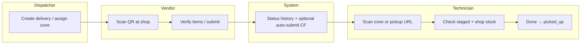

# StageVerify V2 Architecture - C:\Projects\stageverify\docs\stageverify_v2_architecture.md

> **Audience:** Engineers and agents implementing V2  
> **Status:** Reference architecture — Phase 2 active (2026-06-05)  
> **Last updated:** 2026-06-05  
> **Companion docs:** `docs/stage_verify_principles.md`, `docs/roadmap.md`, `docs/project_state.md` (archived detail: `docs/archives/stageverify_implementation_plan.md`)

---

## Section 1: Current V1 Architecture

### What exists today

StageVerify V1 is a **material staging and pickup accountability** web app for HVAC/construction shop operations. It is **not** an ERP, WMS, or inventory system — and it does **not** replicate BuildOps stock management (see **BuildOps Integration Boundary** in Section 2). It tracks **delivery orders** from vendor arrival through dispatcher staging assignment to technician pickup, with QR-driven portals for each actor.

#### Stack and deployment

| Layer        | Technology                                                                   |
| ------------ | ---------------------------------------------------------------------------- |
| Frontend     | React 19, TypeScript (strict), Vite, React Router 7 (HashRouter), Tailwind 4 |
| QR           | html5-qrcode, compact hash URLs (`#/r?i=`, `#/r?z=`, `#/p?j=&d=`)            |
| Backend data | Firebase Firestore (`stageverify-db`)                                        |
| Backend jobs | firebase-functions v2 (`autoSubmitDeliveries`, scheduled every 5 min)        |
| Hosting      | GitHub Pages — https://lgarage.github.io/stageverify                         |
| Auth         | Firebase Auth (dispatcher/settings/vendors/zones/hub)                        |

#### Data models (`src/dispatcher/models.ts`)

| Model                | Role                                                                                                                    |
| -------------------- | ----------------------------------------------------------------------------------------------------------------------- |
| `Job`                | Customer job/project (`jobNumber`, `jobName`, status)                                                                   |
| `Vendor`             | Supplier (name, contact, email, supplies)                                                                               |
| `PurchaseOrder`      | Links job + vendor + PO number                                                                                          |
| `DeliveryOrder`      | **Core entity** — status lifecycle, staging, shop stock pick list, notes                                                |
| `Item`               | Line items (`qtyOrdered`, `qtyReceived`, `qtyMissing`, `qtyDamaged`, `qtyBackordered`, `status`, optional `locationId`) |
| `StagingLocation`    | Physical zone (`code`, `label`, `type`, `LocationStatus`, `eslTagId`, dimensions)                                       |
| `StatusHistoryEvent` | Audit trail (`entityType`, `fromStatus`, `toStatus`, `actorType`)                                                       |
| `PickupEvent`        | Technician pickup record                                                                                                |
| `AppSettings`        | `vendorRevertWindowMinutes`, `autoSubmitMinutes`, `entrywayEslTagId`                                                    |

**Delivery statuses (V1):** `pending` → `shipped` → `arrived` → `partial` → `ready_for_pickup` → `picked_up` → `installed` (plus `complete`, `issue`). UI labels map via `DELIVERY_STATUS_LABEL` (e.g. `ready_for_pickup` = “Staged”).

#### Firestore collections

`deliveries`, `jobs`, `vendors`, `purchaseOrders`, `items`, `stagingLocations`, `statusHistory`, `pickupEvents`, `appSettings`

#### Routes (`src/main.tsx`)

| Route                 | Page                                   | Auth      |
| --------------------- | -------------------------------------- | --------- |
| `/#/receive`          | `ReceivingPage` — **canonical** vendor check-in | Public    |
| `/#/checkin/:orderId` | Redirect → `/#/receive?id=`          | Public    |
| `/#/`                 | Redirect → `/#/receive` (or `/hub` if logged in) | Public    |
| `/#/pickup`           | `PickupPortalPage`                     | Public    |
| `/#/display`          | `EntryDisplayPage` — ESL/entry display | Public    |
| `/#/login`            | `LoginPage`                            | Public    |
| `/#/hub`              | `MobileHubPage`                        | Protected |
| `/#/dispatcher`       | `DispatcherDashboardPage`              | Protected |
| `/#/settings`         | `SettingsPage`                         | Protected |
| `/#/vendors`          | `VendorsPage`                          | Protected |
| `/#/zones`            | `ZoneManagementPage`                   | Protected |

Logged-in users at `/` redirect to `/hub`.

#### Services and integration points

| Module                   | Responsibility                                                                         |
| ------------------------ | -------------------------------------------------------------------------------------- |
| `src/dispatcher/firestoreService.ts` | `FirestoreDataService` — CRUD, status transitions, pickup batch writes, zone occupancy |
| `src/dispatcher/service.ts`          | `DispatcherDataService` interface, `VALID_TRANSITIONS`, revert targets, query types    |
| `src/receiveQrUrls.ts`               | QR URL builders/parsers, prod base URL, ESL render props                               |
| `src/scanRouting.ts`                 | Central scan disposition (`handleScannedQr`, zone vs delivery routing)                 |
| `functions/src/index.ts` | `autoSubmitDeliveries` — idle vendor check-in auto-submit for `arrived` deliveries     |

#### UI components (major)

- **Dispatcher Dashboard** — searchable delivery list, detail drawer, status buttons, staging assign, shop stock editor, print label QR
- **Vendor Check-In** (`ReceivingPage`) — single UI at `/#/receive`; `exception_only`: Scan → PIN → Delivered hub (Need More Space, Issue, DELIVERED); `full_checkin`: line-item flow on same page
- **Pickup Portal** (`PickupPortalPage.tsx`) — job/delivery list filtered by pickup-eligible `DeliveryStatus`; per delivery shows **staging zone code(s)** (`stagingLocationCode`), **line items** (description, qty), **shop stock pick list** (free-text `shopStockPickListItems`, optional `shopStockLocationNote`), delivery status label, Done → `PickupEvent` + status `picked_up`. V1 does **not** show `currentLocationNote`, `materialSource`, `availabilityStatus`, readiness status, or issue reporting.
- **Zone Management** — CRUD staging locations, QR preview, print all active labels, occupancy guard
- **Settings / Vendors** — app timers, staging spot list, vendor CRUD (separate pages per scope rejections)

### How V1 works end-to-end



1. **Dispatcher** creates job/PO/delivery, assigns **staging location** (with occupancy guard), may add **shop stock pick list** lines.
2. **Vendor driver** scans zone or delivery QR → routed to **receive** or **check-in** based on `DeliveryStatus` (`shouldRouteScanToPickup`, `scanRouting.ts`).
3. Vendor confirms line items (received, missing, damaged, backordered) → delivery moves toward **ready_for_pickup** (“Staged”).
4. **Technician** opens pickup portal (or scans status-aware zone QR) → pickup **queue** lists deliveries in pickup-eligible statuses (`PICKUP_PORTAL_DELIVERY_STATUSES`); **detail view** shows line items, shop stock pick list, and **assigned staging zone code(s)** — not last-known physical location beyond optional shop-stock location note → checks off items → **Done** writes `PickupEvent` and updates status.
5. **Status history** records every transition with `actorType` (dispatcher, vendor, technician, system).
6. **E-tag / display** — zone labels and entry display show live Firestore state; Minew ESL API integration is designed but **blocked on vendor credentials**.

### What V1 does well

- **Clear actor separation** — public vendor/tech portals vs authenticated dispatcher tools
- **QR-first floor workflow** — compact URLs, legacy token support, status-aware routing
- **Auditability** — `StatusHistoryEvent` on every transition
- **Staging discipline** — occupancy guard, multiple zones per delivery, Need More Space tiering
- **Pickup accountability** — checkbox verification + `PickupEvent`, not just status flips
- **Deployable MVP** — live on GitHub Pages with Firestore rules tuned for public writes where needed
- **Extension points** — `ActorType` includes `system`; models already separate job/PO/vendor/delivery/items

---

## Section 2: Proposed V2 Architecture

### Overview of V2 changes

V2 reframes StageVerify from a **staging tracker** to a **Material Readiness platform**:

- **Readiness** is explicit (Ordering → Not Ready → Ready For Pickup → Picked Up), not inferred only from `DeliveryStatus`
- **Vendor email** becomes the primary automation input (after prototype phase)
- **Technician verification** creates structured **material issues**, not ad-hoc `issueSummary` text
- **Material Owner** closes the loop on issues with typed resolutions
- **AI** parses and suggests; **humans** correct; **Vendor Knowledge Base** retains vendor-specific language

V2 adds fields and **phase-gated** collections **alongside** V1 data — no big-bang rewrite. New Firestore collections are created only when their implementing phase gate requires them.

### BuildOps Integration Boundary

StageVerify and BuildOps are complementary systems with a hard scope split. StageVerify **consumes** information from BuildOps (PO numbers, job info) but does **not** replicate BuildOps features.

**BuildOps owns:**

- Inventory counts
- Stock levels and min/max quantities
- Reorder points and purchasing
- Warehouse management

**StageVerify owns:**

- Material readiness (is it here and ready?)
- Material location (where is it right now?)
- Pickup verification (did the technician get everything?)
- Material issues (what went wrong and who resolves it?)
- Vendor accountability (did the vendor deliver correctly?)

Agents and engineers must treat BuildOps as the system of record for inventory and procurement. StageVerify answers floor-level accountability questions — not warehouse quantity management.

### New actors: Material Owner

| Aspect         | V1                                          | V2                                                   |
| -------------- | ------------------------------------------- | ---------------------------------------------------- |
| Accountability | Implicit (dispatcher handles drawer issues) | Explicit `materialOwner` on job or delivery          |
| Responsibility | Ad hoc status/issue notes                   | Owns open `MaterialIssue` until resolved             |
| UI             | Dispatcher dashboard only                   | Issues queue, assignment, resolution UI (Phases 3–4) |

Material Owner may be dispatcher, PM, lead tech, or service manager — **role is data**, not a new login type or `actorType` that gates Firebase Auth. Material Owner is an operational responsibility stored on job or delivery documents; it does not become a new auth role.

**Precedence:** When both job-level and delivery-level `materialOwner` exist, **delivery-level overrides job-level**. When neither is set, the system surfaces an explicit gap (e.g. “Unassigned”) — it does not silently assign a default owner. Issue-owner reassignment must be auditable — via `StatusHistoryEvent` or equivalent. (`StatusHistoryEvent` today tracks delivery status transitions; issue-owner assignment events may need their own record type — phase-gated to Phase 3–4.)

### New data concepts

| Concept                                | Purpose                                                                                                                           |
| -------------------------------------- | --------------------------------------------------------------------------------------------------------------------------------- |
| **MaterialIssue**                      | Structured problem from technician (missing, wrong, damaged); links to delivery/items; status open → assigned → resolved → closed |
| **VendorEmailEvent**                   | Ingested or sample email record; parsed fields; confidence; links to PO/delivery                                                  |
| **AICorrection**                       | Human override of AI parse (original vs corrected, reason, vendor, timestamp)                                                     |
| **VendorKnowledgeBase**                | Per-vendor terminology and rules (e.g. “Qty B/O” = backordered) derived from corrections                                          |
| **IssueResolution**                    | Typed resolution action + minimal fields (assignee, supply house, notes); 1:1 resolution record per `MaterialIssue` — final storage (embedded sub-document vs separate collection) deferred to Phase 4 gate |
| **ReadinessStatus**                    | Business readiness separate from or mapped to delivery status                                                                     |
| **ExpectedMaterials / ShopStockItems** | **ExpectedMaterials** = items required for a job/delivery (today: `Item` records on a `DeliveryOrder`). **ShopStockItems** = lines to pull from existing stock (today: `shopStockPickListItems: string[]` on `DeliveryOrder`). Phase 2 keeps these as-is; V2 may extend toward structured form but no new collection or full structured system in Phase 2. Phase 3+ defines pickup UI grouping of vendor vs shop-stock items. |
| **AIConfidenceScore**                  | Gates automation vs human review                                                                                                  |

### How V1 and V2 coexist during transition

| Strategy                   | Detail                                                                                                 |
| -------------------------- | ------------------------------------------------------------------------------------------------------ |
| **Parallel fields**        | Add optional V2 fields on `DeliveryOrder`, `Job`, `Item`; old clients ignore them                      |
| **Dual status**            | Keep `DeliveryStatus` for portals; add `readinessStatus` or map via service layer until UI catches up  |
| **New collections**        | **Verified:** V1 uses flat root-level collections only (`deliveries`, `items`, `jobs`, etc. — confirmed in `firestore.rules` and `firestoreService.ts`; no tenant or document subcollections). V2 planned collections extend the same flat pattern: `materialIssues`, `vendorEmailEvents`, `aiCorrections`, `vendorKnowledge` — unless a future phase explicitly adopts subcollections. **Making the data model tenant-safe** (field boundaries, rules discipline) ≠ **adding tenant subcollections now** ≠ **building a multi-tenant product** (see roadmap MAYBE). **Create each collection only when the active phase gate explicitly requires it** — do not pre-provision ahead of gate. Never break existing reads. |
| **Feature flags by phase** | Phase 2: types + optional backward-compatible fields + only persistence required by the Phase 2 gate (no UI, processors, email, or AI). Phase 3+: UI surfaces issues; Phase 5+: email prototype offline |
| **QR routing**             | Extend `scanRouting` disposition logic; preserve compact hashes (`#/r?z=`, `#/r?i=`, `#/p?j=`), legacy parsers, and status-aware routing to existing targets (receive-page, checkin-page, app-checkin, pickup portal). Readiness is a **decision input** to routing — not necessarily a new URL destination; a `not_ready` route target is possible but not confirmed in roadmap or phase plan. Readiness-aware routing changes are **Phase 4+** per roadmap. |
| **Firestore rules**        | Add rules per collection incrementally; security gate on every rules change                            |

---

## Section 3: Material Readiness Workflow

### What exists today vs V2

| Step            | V1                                         | V2                                                       |
| --------------- | ------------------------------------------ | -------------------------------------------------------- |
| PO → shop       | Manual delivery creation                   | Same; optional email-derived updates                     |
| Readiness       | Inferred from `DeliveryStatus` + item qtys | Explicit **Not Ready** / **Ready For Pickup** with rules |
| Vendor signal   | QR check-in only                           | + vendor email monitoring                                |
| E-tag           | Manual/display refresh; ESL API pending    | Auto-update on readiness (Phase 7)                       |
| Tech visibility | Pickup list filtered by status             | Queue shows **Ready For Pickup** deliveries; detail view shows all materials for context (see below) |

### Reuse vs add

| Reuse                                  | Add                                                 |
| -------------------------------------- | --------------------------------------------------- |
| `DeliveryOrder`, `Item` qty fields     | `readinessStatus`, readiness reason codes           |
| `VALID_TRANSITIONS` (extend carefully) | Readiness rules engine (email + issues + backorder) — **Phase 4+**; not Phase 2 |
| `DELIVERY_STATUS_LABEL`                | User-facing readiness labels aligned to principles  |
| Dispatcher drawer                      | Readiness badge, block pickup when Not Ready — **Phase 3+** UI |

### Backorders and readiness

An unresolved backorder **normally blocks** overall readiness (`Not Ready`), but an authorized person may mark an individual item as nonblocking, substituted, waived, or otherwise resolved — with an audit trail preserved (`StatusHistoryEvent` or equivalent). Blocking is the default; explicit human resolution is the exception.

---

## Material Location Architecture

### Assigned Location vs Current Location

StageVerify must track two distinct location concepts:

- **Assigned Location** — where material _should_ be staged (set by dispatcher, e.g. "G2"). This is the `stagingLocationId` on a `DeliveryOrder`.
- **Current Location (Last Known Location)** — where material _actually is right now_ (e.g. "Office Counter", "Receiving Area", "G2"). This may differ from assigned location when delivery arrived but hasn't been moved to the staging zone yet.

The system must always be able to answer:

1. "Where should this material be?" → Assigned Location
2. "Where is this material right now?" → Current Location

All actors (technicians, office staff, dispatchers) need both answers.

### Material Availability States

`availabilityStatus` tracks **physical receipt and pickup confirmation** — not location or staging:

- **Expected** — material should exist for the job (on the PO, not yet received)
- **Received** — material has arrived at the facility
- **Picked Up** — technician confirmed pickup

**Location is an attribute, not an `availabilityStatus` value.** Whether material has a recorded last-known physical location is captured by the presence and content of `currentLocationNote` — not a separate enum. A material can simultaneously be: received + located at office counter (via `currentLocationNote`) + not staged + not ready + not picked up.

A material may be Received but Not Yet Staged — the technician must still be able to find it. `currentLocationNote` handles this gap; it does not require a `located` lifecycle state.

### Related but distinct status dimensions

Do not collapse these into a single status field — they are related but independent:

| Dimension | V1 / V2 field | Answers |
| --------- | ------------- | ------- |
| **Business readiness** | `ReadinessStatus` (V2) / mapped from `DeliveryStatus` (V1) | Is the overall package ready for technician pickup? |
| **Physical receipt / availability** | `availabilityStatus` (V2 recommendation): `expected` \| `received` \| `picked_up` | Has material arrived? Has pickup been confirmed? |
| **Staging state** | Derived from `stagingLocationId`, `availabilityStatus`, and `currentLocationNote` | Has received material reached its assigned staging location? Derivable when `stagingLocationId` is set AND `availabilityStatus` is `received` AND `currentLocationNote` matches the staging zone (or an explicit `isStaged` boolean if a later phase adds one). |
| **Assigned destination** | `stagingLocationId` on `DeliveryOrder` | Where should this material be staged? |
| **Last known physical location** | `currentLocationNote` (V2 recommendation) | Where is it right now? Presence/absence of this field answers "has a location been recorded?" — replaces a `located` enum value. |
| **Pickup confirmation** | `PickupEvent` | Did the technician confirm pickup? |

`DeliveryStatus` (V1 workflow) and `Item.status` (line-level receipt state) remain separate from readiness and availability.

### Material Source

Materials may come from multiple sources within one delivery:

- **Vendor Delivery** (`vendor_delivery`) — arrives via vendor, tracked through the check-in workflow
- **Shop Stock** (`shop_stock`) — pulled from existing stock before technician departs
- **Direct Shipment** (`direct_shipment`) — ad-hoc carrier or manufacturer drop (Amazon, UPS, FedEx, etc.)
- **Unknown** (`unknown`) — source not yet determined

StageVerify is NOT an inventory system. It does not track inventory quantities, reorder points, or stock levels. It only needs to know _that_ a material needs to be pulled from shop stock and _where_ in the shop to find it.

**Primary placement: `Item` (material line) level.** A delivery may contain mixed sources — vendor items, shop-stock pulls, and direct shipments in the same package. Recording `materialSource` at the delivery level as a default adds ambiguity; prefer per-line `Item` values. `materialSource` is pickup-accountability data — not inventory management.

For Shop Stock items:

- The technician needs to pull items before leaving
- Current Location = shop stock area (e.g. "Main Shop Stock Area")
- Action = "Pull From Stock"
- These items appear in pickup verification alongside vendor-delivered items

### Unstaged Deliveries

Some deliveries arrive outside normal vendor workflows (Amazon, UPS, FedEx, manufacturer direct). Office staff must be able to:

- Search by PO to identify the material
- Record current location (e.g. "Office Counter")
- Associate with the assigned staging location and destination job
- Status: "Received - Not Yet Staged"

The material must still appear in technician pickup verification regardless of whether it reached its assigned staging zone. **Today:** received-but-unstaged material is visible in the **dispatcher dashboard**; the public pickup portal does not yet expose last-known physical location.

### Not-ready job access

Finding a **not-ready** job is separate from pickup queue eligibility:

| Path | Who | What they see |
| ---- | --- | ------------- |
| **Public pickup portal** | Technician (no auth) | Queue lists only **`ready_for_pickup`** packages (V2: aligned `ReadinessStatus`). Not-ready jobs do not appear in the queue. |
| **Pickup detail view** (V2 Phase 3+) | Technician with an open job | All material states for context — received-but-unstaged, missing, shop-stock, etc. |
| **Dispatcher view** (V1 today) | Authenticated dispatcher | Full delivery list including received-but-unstaged and not-ready statuses. |
| **Office fast-path** (LATER phase) | Authenticated office staff | Search by PO → record current location → material surfaces in technician pickup detail — distinct from Phase 3 display-only unstaged material. |

A not-ready job does **not** need to enter the pickup queue to be visible to authorized users.

### Pickup queue eligibility vs detail visibility

These are **distinct concerns** — do not conflate them:

| Concern | Scope | Rule |
| ------- | ----- | ---- |
| **(A) Queue eligibility** | Which deliveries appear in the technician pickup list | Delivery/package is **`ready_for_pickup`** (V1: `DeliveryStatus`; V2: aligned `ReadinessStatus`) |
| **(B) Detail visibility** | What materials a technician sees inside a job/delivery detail view | **All** materials regardless of line state: received-but-unstaged, missing, backordered, shop-stock, substituted, waived |

Queue eligibility answers: *Is this package ready?* Detail visibility answers: *What is expected? What arrived? Where is it? What still needs to be grabbed or resolved?*

V1 pickup portal today includes `ready_for_pickup`, `partial`, `complete`, `picked_up`, and `installed` in its public list filter (`PICKUP_PORTAL_DELIVERY_STATUSES` in `firestoreService.ts`). V2 should tighten queue eligibility toward readiness while preserving full material visibility in the detail view.

### Pickup Verification Goal

The technician screen answers: **"What do I still need to grab before leaving?"** — not "what workflow state is this material in?"

Pickup experience prioritizes:

1. Material visibility (what do I need?)
2. Material location (where do I get it?)
3. Material completeness (do I have everything?)

### Phase 2 Data Model Recommendations (for location tracking)

The following are **recommendations only** — not implemented yet. Evaluate alongside Phase 2 data model work before implementation.

1. **`currentLocationNote`** (optional string) on `DeliveryOrder` — free-text last known location, distinct from `stagingLocationId` (assigned location). Example: "Office Counter", "Receiving Area". Answers "has a location been recorded?" — no separate `located` enum needed.
2. **`materialSource`** (optional union: `"vendor_delivery" | "shop_stock" | "direct_shipment" | "unknown"`) on **`Item`** (primary) — per-line source within a mixed delivery. Pickup-accountability only; not inventory tracking.
3. **`availabilityStatus`** (optional union: `"expected" | "received" | "picked_up"`) on `DeliveryOrder` and/or `Item` — physical receipt and pickup confirmation, distinct from `DeliveryStatus` workflow state and from location (`currentLocationNote`).
4. **`currentLocationNote`** on `Item` — individual line items may be in different locations.
5. **`shopStockLocationCode`** (optional string) on `Item` — structured shop area code for shop stock items (complements the existing free-text `shopStockPickListItems` array on `DeliveryOrder`).

---

## Section 4: Vendor Email Workflow

### What exists today vs V2

| Capability           | V1                                      | V2                                           |
| -------------------- | --------------------------------------- | -------------------------------------------- |
| Vendor communication | `Vendor.email` field only; no ingestion | Parse confirmations, backorders, partials    |
| Automation           | None                                    | Phase 5: offline prototype only. Phase 6: live monitor with human-reviewed proposals first; narrow automation for pre-approved event types only |
| Confidence           | N/A                                     | Gates automation vs human review (see AI authority policy below) |

### Reuse vs add

| Reuse                                              | Add                                    |
| -------------------------------------------------- | -------------------------------------- |
| `Vendor`, `PurchaseOrder`, `DeliveryOrder` linking | `VendorEmailEvent` collection          |
| `Item` status updates from check-in                | Same updates driven by parsed email    |
| `StatusHistoryEvent` with `actorType: "system"`    | Email-processed events                 |
| Dispatcher search/filter                           | “Pending email review” queue (Phase 6) |

### AI authority policy (all phases)

**Before an approved automation gate:**

- AI **may:** extract information, classify, match, calculate confidence, explain evidence, propose changes for human review
- AI **may NOT:** update operational records, change delivery status, or declare material ready for pickup

**After an approved automation gate** (only narrowly defined, gate-approved actions):

- High confidence alone is **not** blanket permission to update operational records
- Each automated action must be **explicitly approved** in that gate

**Human review triggers** include business risk, missing information, conflicting evidence, or action type — not only a numeric confidence score below a threshold.

> **Confidence caveat:** Model-generated confidence scores are not automatically calibrated probabilities. Any numeric threshold (e.g. 90%) is an initial target — justify it with correction history, validation results, false-positive rates, and action severity. Harmless recommendations and readiness-changing actions warrant different standards.

---

## Section 5: Technician Verification Workflow

### What exists today vs V2

| Capability   | V1                                    | V2                                              |
| ------------ | ------------------------------------- | ----------------------------------------------- |
| Pickup UI    | Check staged lines + shop stock; Done | + **Expected Materials** list; **Report Issue** |
| Verification | Checkbox completion gate              | Explicit “Everything Present” vs issue path     |
| Problems     | `issueSummary` text; `issue` status   | `MaterialIssue` records + owner assignment      |
| Identity     | Technician name on pickup             | Same; link issues to pickup                     |

### Reuse vs add

| Reuse                                                  | Add                                        |
| ------------------------------------------------------ | ------------------------------------------ |
| `PickupPortalPage`, `PickupEvent`, `recordPickupEvent` | `issueIds[]` on pickup; issue creation API |
| QR deep links (`buildPickupDeepLink`)                  | Route only Ready For Pickup deliveries     |
| Shop stock checkboxes                                  | Structured expected materials UI           |
| Playwright `verify:pickup`                             | Extend for issue flow (Phase 3)            |

---

## Section 6: Material Owner Workflow

### What exists today vs V2

| Capability    | V1                                       | V2                                          |
| ------------- | ---------------------------------------- | ------------------------------------------- |
| Owner         | Not modeled                              | `materialOwnerId` / name on job or delivery |
| Work queue    | Dispatcher scans list for `issue` status | Dedicated **Material Issues** view          |
| Assignment    | Manual dispatcher action                 | Suggest job-level owner as default; delivery-level owner overrides; reassignment audited |
| Notifications | None in app                              | Future: email/Slack (MAYBE)                 |

### Reuse vs add

| Reuse                                       | Add                                                           |
| ------------------------------------------- | ------------------------------------------------------------- |
| Dispatcher dashboard shell, `PortalSidebar` | Issues nav item (scope: confirm with `USER_SCOPE_REJECTIONS`) |
| `DeliveryDetails` aggregation               | Join open issues                                              |
| Auth + `ProtectedRoute`                     | Owner-filtered views (optional)                               |

---

## Section 7: Issue Resolution Workflow

`IssueResolution` is the resolution record for a `MaterialIssue` — a **1:1 relationship per issue**. Whether resolution data lives as an embedded sub-document or a separate collection is deferred to the **Phase 4 gate**; this architecture doc does not commit to final storage.

### What exists today vs V2

| Capability       | V1                           | V2                                                       |
| ---------------- | ---------------------------- | -------------------------------------------------------- |
| Resolution       | Manual status revert / notes | Typed resolutions (Found in Shop, Ferguson pickup, etc.) |
| Closure          | Ad hoc                       | Issue state machine + resolution history                 |
| Tech visibility  | None                         | View resolution on pickup/issue screen                   |
| Readiness impact | Manual                       | **Hold Job / Not Ready** resolution flips readiness      |

### Reuse vs add

| Reuse                            | Add                              |
| -------------------------------- | -------------------------------- |
| `StatusHistoryEvent`             | Resolution events                |
| `issue` delivery status (legacy) | Map to/open `MaterialIssue`      |
| Drawer status buttons            | Resolution panel in issue detail |

---

## Section 8: AI Learning Workflow

### What exists today vs V2

| Capability      | V1                               | V2                                                           |
| --------------- | -------------------------------- | ------------------------------------------------------------ |
| AI              | None                             | Parse → score → auto or review                               |
| Learning        | None                             | Corrections → knowledge base → rules                         |
| Source of truth | Firestore + human portal actions | Emails + slips + **human corrections** (AI never sole truth) |

### Reuse vs add

| Reuse                         | Add                                                  |
| ----------------------------- | ---------------------------------------------------- |
| `ActorType: "system"` history | AI action logging                                    |
| Cloud Functions pattern       | Email processor, confidence evaluator (later phases) |
| —                             | `AICorrection`, `vendorKnowledge` collections (phase-gated — not Phase 2) |
| —                             | Correction UI in dispatcher review queue             |

**Principle:** Observe → Suggest → Validate → Automate.

| Step | AI may | AI may not |
| ---- | ------ | ---------- |
| **Observe** | Extract, classify, match, score, explain (no operational writes) | Update records or declare readiness |
| **Suggest** | Propose changes for human review with evidence and confidence | Apply changes without review |
| **Validate** | Confirm proposals against approved test data, correction history, false-positive limits, and action severity | Skip validation gates |
| **Automate** | Execute narrow, explicitly approved action types only after gate passes | Operate broadly on "high confidence" alone |

Phase 8 gate requires demonstrated reuse of corrections. Until an approved automation gate passes, AI follows the **AI authority policy** (Section 4): Observe and Suggest only — no operational writes or readiness declarations. After a gate, only gate-approved actions may Automate; high confidence alone is insufficient.

---

## Section 9: Vendor Knowledge Base Concept

### Terminology (use consistently)

| Name | Meaning |
| ---- | ------- |
| **`VendorKnowledgeEntry`** (or **`VendorKnowledge`**) | Conceptual data model / TypeScript interface type for one vendor-scoped terminology rule |
| **`VendorKnowledgeBase`** | Overall system component — the per-vendor learning store derived from human corrections |
| **`vendorKnowledge`** | Firestore collection name (flat root-level; created only when Phase 8 gate passes) |

Do not use all three interchangeably. In prose about the system, say "Vendor Knowledge Base"; in schema/interface discussion, say `VendorKnowledgeEntry`; when naming the collection, say `vendorKnowledge`.

### Data structure (conceptual)

```
VendorKnowledgeEntry
├── vendorId
├── vendorName
├── termOrPattern          // e.g. "Qty B/O", "Short Ship"
├── meaning                // e.g. backordered, not delivered
├── fieldMapping           // which Item/Delivery field to update
├── confidenceBoost        // optional increment when pattern matches
├── sourceCorrectionIds[]  // lineage from human corrections
├── createdAt / updatedAt
└── active                 // soft-disable without delete
```

Entries are **vendor-scoped** (per `vendorId`), not global — Ferguson ≠ Johnstone terminology. In the verified flat Firestore layout, the `vendorKnowledge` collection follows the same root-level pattern as V1; there are no tenant subcollections today.

**Promotion policy:** Repeated human corrections may justify **proposing** a new `VendorKnowledgeEntry` for human approval, but no arbitrary correction count automatically creates a trusted active rule. A human must approve promotion from **proposed rule** → **active rule**. Every entry must be traceable to source `AICorrection` records and auditable.

**Collection timing:** The `vendorKnowledge` Firestore collection is created **only when the Phase 8 gate** passes — not during Phase 2. Until then, `VendorKnowledgeEntry` remains an interface stub only.

### How corrections feed in

1. AI proposes parse on `VendorEmailEvent`.
2. Human edits fields in review UI → writes `AICorrection`.
3. Repeated corrections for same vendor + pattern → **propose** a `VendorKnowledgeEntry` in the Vendor Knowledge Base for human approval (not auto-promote).
4. After human approval, future parses apply active knowledge **before** generic model prompt.
5. Confidence tracking down-weights vendors with high correction rates.

---

## Section 10: Human Correction Loop Concept

### Capture

| Field                     | Purpose                                      |
| ------------------------- | -------------------------------------------- |
| `entityType`              | `vendor_email_event` \| `delivery` \| `item` |
| `entityId`                | Target document                              |
| `originalInterpretation`  | JSON snapshot of AI output                   |
| `correctedInterpretation` | Human-approved fields                        |
| `reason`                  | Optional free text                           |
| `correctedBy`             | Dispatcher user id / name                    |
| `vendorId`                | For knowledge clustering                     |
| `createdAt`               | Audit                                        |

### Store

- Primary: `aiCorrections` collection (immutable append) — **created only when the phase gate that requires correction persistence passes** (not Phase 2 by default).
- Secondary: reference from `VendorEmailEvent.humanReviewedAt` / `correctionId`.
- Tertiary: `StatusHistoryEvent` summary for dispatcher-visible timeline.

### Reference

- Parser selects relevant corrections by vendor, document template, terminology, mapping similarity, or pattern — recency alone is not necessarily the right retrieval strategy; the implementing phase (Phase 8) chooses the approach.
- Rule engine (Phase 8): if correction count ≥ threshold for same mapping → **propose** knowledge entry for human approval (never auto-activate).
- Metrics: correction rate per vendor, per template, per week — feeds confidence calibration.

---

## Section 11: Part Classification Concept

### Categories (from principles)

Motors, Belts, PVC, Controls, Filters, Large Equipment, Electrical, Hardware — extensible enum on `Item`.

### V2 integration

| Use                            | Benefit                                                          |
| ------------------------------ | ---------------------------------------------------------------- |
| Pickup verification            | Group expected materials by category                             |
| Issue analytics                | “Most missing: Controls”                                         |
| Staging intelligence (Phase 9) | Large Equipment → oversized spot suggestions                     |
| Email parsing                  | Map vendor line descriptions → classification via knowledge base |
| Delivery complexity score      | Weight by category mix and dimensions                            |

Classification is **assistive**, not inventory SKU management — no stock counts, no reorder points.

---

## Section 12: Future AI Recommendation Concept

### Recommendation types (Phase 9)

| Type                  | Example output                                             | Human action                  |
| --------------------- | ---------------------------------------------------------- | ----------------------------- |
| Staging suggestion    | “Use G4 — last 3 large equipment deliveries overflowed G2” | Accept / override / disable   |
| Vendor risk           | “Vendor X: 40% backorder rate last 90 days”                | Informational                 |
| Delivery complexity   | “Score 8/10 — allocate 4×10 ground”                        | Dispatcher still assigns zone |
| Issue resolution hint | “Similar issue resolved via Ferguson pickup”               | Material Owner chooses        |

### Minimum confidence requirements

- **Automate readiness change (Phase 6+):** requires approved automation gate + defined action type + calibrated evidence + validation data + false-positive limit + rollback/review controls. **High confidence alone does NOT authorize readiness changes.** Phase 6 describes live monitoring with human-reviewed proposals first; narrow approved automation only for explicitly defined event types. Gate measures performance on approved test data with bounded false-positive rates — not a guarantee of zero errors.
- **Recommendations (Phase 9):** **≥ 90%** confidence initial target to surface (not a proven accuracy guarantee).
- Each recommendation includes: confidence score, supporting history summary, plain-language explanation.
- Overrides logged; recommendations can be disabled globally or per type.
- AI **never** assigns staging locations (principles: dispatcher assigns).

> **Confidence caveat:** Model-generated scores are not automatically calibrated probabilities. Thresholds must be justified by correction history, validation runs, false-positive rates, and action severity. Readiness-changing automation warrants stricter evidence than harmless informational recommendations.

---

## Section 13: Composer 2.5 Guidance

### Required reading (before any V2 work)

1. `docs/stage_verify_principles.md`
2. `docs/roadmap.md` (phase gates; archived plan: `docs/archives/stageverify_implementation_plan.md`)
3. `docs/project_state.md`
4. `docs/stageverify_v2_architecture.md` (this document)

Also read `PROJECT_STATUS/CURRENT_STATE.md` and, when touching nav/QR/public routes, `PROJECT_STATUS/MODEL_DOSSIER.md` and `USER_SCOPE_REJECTIONS.md`.

### Composer rules

| Rule                  | Detail                                                                                                                                       |
| --------------------- | -------------------------------------------------------------------------------------------------------------------------------------------- |
| Phase discipline      | Only work on **current phase** in `project_state.md`; do not skip gates                                                                      |
| Architecture          | Do not redesign V2 architecture ad hoc                                                                                                       |
| Non-goals             | No ERP, WMS, inventory, accounting, purchasing, dispatch platform features                                                                   |
| BuildOps boundary     | Do not add inventory quantity tracking; do not replicate BuildOps stock management features (counts, min/max, reorder, warehouse management) |
| Location vs inventory | `currentLocationNote` is NOT inventory — it is a location pointer for pickup; never conflate with stock-on-hand                              |
| Shop stock scope      | Shop Stock items track _location and action_ ("Pull From Stock"), not _quantity on hand_                                                     |
| Preservation          | Existing portals and Firestore reads must keep working                                                                                       |
| Milestones            | Update `docs/project_state.md` after major milestones (and `PROJECT_STATUS/CURRENT_STATE.md` per ship loop)                                  |
| Models                | New types in `src/dispatcher/models.ts`                                                                                                      |
| Services              | New methods in `src/dispatcher/firestoreService.ts` alongside existing APIs                                                                  |
| Collections           | Add new collections **only when the active phase gate requires them**; do not break existing queries                                         |
| UI changes            | Build + Playwright per `composer-orchestrator.mdc`                                                                                           |
| Backend-critical      | Firestore rules / CF changes → Sonnet security gate after commit                                                                             |
| Ship                  | `ship-loop.mdc` unless Dan says hold                                                                                                         |

---

## Section 14: V2 Transition Risks

### Architecture Risks

| Risk                     | Impact                            | Mitigation                                                              |
| ------------------------ | --------------------------------- | ----------------------------------------------------------------------- |
| Data model migration     | Broken clients, partial documents | Additive optional fields → no migration required. Targeted backfill → only if a later feature explicitly requires it and is documented at that phase's gate. Breaking schema change → requires an explicit migration plan at that phase. |
| Firestore schema growth  | Rule complexity, index needs      | One collection per phase; composite indexes planned early               |
| Collection proliferation | Query joins in browser            | Denormalize display fields on `DeliveryOrder`; keep detail fetches lazy |
| CF + client duplication  | Divergent status types            | The implementing phase must document and commit to a shared-types strategy (shared package vs import from `models.ts`) before coding. Ad-hoc agent choice is not acceptable. |

### Data Model Risks

| Risk                  | Impact                                    | Mitigation                                                 |
| --------------------- | ----------------------------------------- | ---------------------------------------------------------- |
| Backward compat       | Old app versions on gh-pages cache        | Version-less additive fields; avoid renames                |
| Existing reads        | Security rule regressions                 | Sonnet gate; test public pickup/vendor paths               |
| Partial data          | New UI assumes `materialOwner` always set | Surface “Unassigned” gap when neither job nor delivery owner is set; delivery-level owner overrides job-level |
| Dual status confusion | Staged vs Ready For Pickup                | Document mapping table in service layer; single write path |

### Workflow Risks

| Risk                         | Impact                      | Mitigation                                                         |
| ---------------------------- | --------------------------- | ------------------------------------------------------------------ |
| Breaking portals             | Vendor/tech blocked at shop | Phase-gated UI; feature flags; Playwright on all public routes     |
| QR routing assumptions       | Wrong portal after scan     | Extend `scanRouting.ts` only; keep legacy URL parsers              |
| Pickup filter too aggressive | Tech sees empty list        | Align filter with readiness + grace period for legacy deliveries   |
| Auto-submit CF               | Wrong status promotion      | Include `shipped` if needed; separate readiness from vendor submit |

### Adoption Risks

| Risk                      | Impact                          | Mitigation                                                |
| ------------------------- | ------------------------------- | --------------------------------------------------------- |
| Dispatcher learning curve | Issues queue ignored            | Start with drawer tab; minimal columns                    |
| Technician friction       | Extra taps at pickup            | Keep “Everything Present” one path; issue optional fields |
| Material Owner ambiguity  | Issues unowned                  | Surface unassigned gap; delivery owner overrides job owner when both exist |
| Email trust               | Dispatchers override everything | Show confidence + source snippet                          |

### AI Accuracy Risks

| Risk                   | Impact                        | Mitigation                                              |
| ---------------------- | ----------------------------- | ------------------------------------------------------- |
| False Ready For Pickup | Tech drives to job unprepared | Human review on risk/conflict/low confidence; gate measures false-positive rate on test data — not zero-error guarantee |
| Parsing errors         | Wrong item qtys               | Human review queue; no delete of original email payload |
| Confidence calibration | Over-automation               | Track correction rate; decay vendor confidence          |
| Repeated mistakes      | Trust erosion                 | Phase 8 gate: demonstrated reduction of repeated error patterns over a defined window on approved test data |

### Feature Creep Risks

| Risk                   | Impact                         | Mitigation                                                                                                  |
| ---------------------- | ------------------------------ | ----------------------------------------------------------------------------------------------------------- |
| ERP/WMS drift          | Scope explosion                | Principles doc in every PR; reject inventory features                                                       |
| Dispatch platform      | Route techs, trucks            | Out of scope — link to BuildOps only as future MAYBE                                                        |
| Purchasing             | PO creation in app             | Read PO refs only; don’t build procurement                                                                  |
| Full inventory         | Stock levels                   | Shop stock remains pick-list accountability, not stock system                                               |
| BuildOps feature creep | Inventory counts, reorder, WMS | BuildOps owns stock management; StageVerify owns readiness, location, pickup, issues, vendor accountability |

### Mitigation strategies (summary)

1. **Additive-only** schema and API changes through Phase 4.
2. **Phase gates** with Playwright + build before merge.
3. **Centralized routing** — all QR changes in `scanRouting.ts` + `receiveQrUrls.ts`.
4. **Human-in-the-loop progression:** Phase 5 = offline prototype, sample emails, no production automation. Phase 6 = monitored live inbox; human-reviewed proposals; narrow automation only for pre-approved event types. Phase 8 = learning from corrections; correction-informed improvement. Full autonomous operation: never — humans retain final authority.
5. **Explicit non-goals** in code review and `project_state.md`.
6. **Security gate** on every Firestore rules change.

---

## Component Classification Table

**Phase 2 boundary:** Phase 2 authorizes only establishing types/interfaces, adding optional backward-compatible fields on existing models, and creating Firestore persistence **explicitly required by the Phase 2 gate**. Phase 2 does **not** authorize UI workflows, background processors, email parsing, AI integration, or new automation. Rows below note which later phase owns visible or automated behavior.

| Component                                         | Classification | V2 notes                                                                                                       |
| ------------------------------------------------- | -------------- | -------------------------------------------------------------------------------------------------------------- |
| Dispatcher Dashboard                              | **Modify**     | Phase 2: optional field reads only. Phase 3+: readiness + material issues columns/views                        |
| Delivery Detail Drawer                            | **Modify**     | Phase 2: no UI changes. Phase 3–4: issue list, resolution status, readiness panel                            |
| Staging Assignment                                | **Keep**       | Dispatcher-owned; AI suggests only in Phase 9                                                                  |
| QR Routing (`scanRouting.ts`, `receiveQrUrls.ts`) | **Modify**     | Phase 4+ per roadmap: readiness as routing decision input; preserve compact hashes and legacy parsers (not Phase 2) |
| Pickup Workflow                                   | **Modify**     | Phase 2: optional fields only. Phase 3: verification + Report Issue                                          |
| Current Location Tracking                         | **Modify**     | Phase 2: optional `currentLocationNote` field on models. Phase 3: capture/display UI                       |
| Shop Stock Pull List                              | **Modify**     | Phase 2: optional `materialSource` / location fields on models. Phase 3: structured pickup UI                |
| Vendor Check-In (`ReceivingPage`)                 | **Modify**     | Single UI at `/#/receive`; exception-only Delivered hub shipped; legacy `App.tsx` / `CheckInPage` removed (2026-06-11) |
| E-Tag Integration                                 | **Modify**     | Phase 7 automation when Minew creds arrive                                                                     |
| ZoneManagementPage                                | **Keep**       | CRUD + print labels                                                                                            |
| VendorsPage                                       | **Modify**     | Phase 5+: `emailDomain`. Phase 8+: Vendor Knowledge Base refs (not Phase 2)                                  |
| SettingsPage                                      | **Keep**       | Timers, entryway ESL; per scope rejections                                                                     |
| StatusHistoryEvent                                | **Keep**       | System/AI events use existing model                                                                            |
| PickupEvent                                       | **Modify**     | Phase 3+: link `issueIds`, verification metadata (Phase 2: type definition only)                               |
| autoSubmitDeliveries CF                           | **Keep**       | No phase change planned — stays as-is until CF shared-types refactor (roadmap LATER cross-cutting)           |

---

## Document maintenance

Update this file when:

- A phase gate passes and architecture decisions are validated
- New collections or actors are introduced
- QR or readiness mapping changes

Do not use this file as a substitute for `project_state.md` (operational phase tracker).
