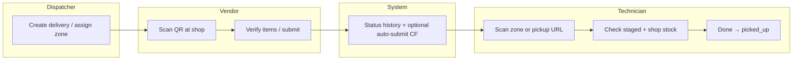

# StageVerify V2 Architecture

> **Audience:** Engineers and agents implementing V2  
> **Status:** Architecture validation (pre–Phase 2 code)  
> **Last updated:** 2026-06-04  
> **Companion docs:** `stage_verify_principles.md`, `stageverify_implementation_plan.md`, `project_state.md`

---

## Section 1: Current V1 Architecture

### What exists today

StageVerify V1 is a **material staging and pickup accountability** web app for HVAC/construction shop operations. It is **not** an ERP, WMS, or inventory system. It tracks **delivery orders** from vendor arrival through dispatcher staging assignment to technician pickup, with QR-driven portals for each actor.

#### Stack and deployment

| Layer | Technology |
|-------|------------|
| Frontend | React 19, TypeScript (strict), Vite, React Router 7 (HashRouter), Tailwind 4 |
| QR | html5-qrcode, compact hash URLs (`#/r?i=`, `#/r?z=`, `#/p?j=&d=`) |
| Backend data | Firebase Firestore (`stageverify-db`) |
| Backend jobs | firebase-functions v2 (`autoSubmitDeliveries`, scheduled every 5 min) |
| Hosting | GitHub Pages — https://lgarage.github.io/stageverify |
| Auth | Firebase Auth (dispatcher/settings/vendors/zones/hub) |

#### Data models (`src/dispatcher/models.ts`)

| Model | Role |
|-------|------|
| `Job` | Customer job/project (`jobNumber`, `jobName`, status) |
| `Vendor` | Supplier (name, contact, email, supplies) |
| `PurchaseOrder` | Links job + vendor + PO number |
| `DeliveryOrder` | **Core entity** — status lifecycle, staging, shop stock pick list, notes |
| `Item` | Line items (`qtyOrdered`, `qtyReceived`, `qtyMissing`, `qtyDamaged`, `qtyBackordered`, `status`, optional `locationId`) |
| `StagingLocation` | Physical zone (`code`, `label`, `type`, `LocationStatus`, `eslTagId`, dimensions) |
| `StatusHistoryEvent` | Audit trail (`entityType`, `fromStatus`, `toStatus`, `actorType`) |
| `PickupEvent` | Technician pickup record |
| `AppSettings` | `vendorRevertWindowMinutes`, `autoSubmitMinutes`, `entrywayEslTagId` |

**Delivery statuses (V1):** `pending` → `shipped` → `arrived` → `partial` → `ready_for_pickup` → `picked_up` → `installed` (plus `complete`, `issue`). UI labels map via `DELIVERY_STATUS_LABEL` (e.g. `ready_for_pickup` = “Staged”).

#### Firestore collections

`deliveries`, `jobs`, `vendors`, `purchaseOrders`, `items`, `stagingLocations`, `statusHistory`, `pickupEvents`, `appSettings`

#### Routes (`src/main.tsx`)

| Route | Page | Auth |
|-------|------|------|
| `/#/` | `App.tsx` — Vendor Check-In scanner | Public |
| `/#/checkin/:orderId` | `CheckInPage` | Public |
| `/#/receive` | `ReceivingPage` — vendor deep link | Public |
| `/#/pickup` | `PickupPortalPage` | Public |
| `/#/display` | `EntryDisplayPage` — ESL/entry display | Public |
| `/#/login` | `LoginPage` | Public |
| `/#/hub` | `MobileHubPage` | Protected |
| `/#/dispatcher` | `DispatcherDashboardPage` | Protected |
| `/#/settings` | `SettingsPage` | Protected |
| `/#/vendors` | `VendorsPage` | Protected |
| `/#/zones` | `ZoneManagementPage` | Protected |

Logged-in users at `/` redirect to `/hub`.

#### Services and integration points

| Module | Responsibility |
|--------|----------------|
| `firestoreService.ts` | `FirestoreDataService` — CRUD, status transitions, pickup batch writes, zone occupancy |
| `service.ts` | `DispatcherDataService` interface, `VALID_TRANSITIONS`, revert targets, query types |
| `receiveQrUrls.ts` | QR URL builders/parsers, prod base URL, ESL render props |
| `scanRouting.ts` | Central scan disposition (`handleScannedQr`, zone vs delivery routing) |
| `functions/src/index.ts` | `autoSubmitDeliveries` — idle vendor check-in auto-submit for `arrived` deliveries |

#### UI components (major)

- **Dispatcher Dashboard** — searchable delivery list, detail drawer, status buttons, staging assign, shop stock editor, print label QR
- **Vendor Check-In** (`App.tsx`) — scan QR, verify quantities, damaged/missing, Need More Space overflow, submit
- **Pickup Portal** — job/delivery load, staged + shop stock checkboxes, Done → `PickupEvent` + status `picked_up`
- **Zone Management** — CRUD staging locations, QR preview, print all active labels, occupancy guard
- **Settings / Vendors** — app timers, staging spot list, vendor CRUD (separate pages per scope rejections)

### How V1 works end-to-end



1. **Dispatcher** creates job/PO/delivery, assigns **staging location** (with occupancy guard), may add **shop stock pick list** lines.
2. **Vendor driver** scans zone or delivery QR → routed to **receive** or **check-in** based on `DeliveryStatus` (`shouldRouteScanToPickup`, `scanRouting.ts`).
3. Vendor confirms line items (received, missing, damaged, backordered) → delivery moves toward **ready_for_pickup** (“Staged”).
4. **Technician** opens pickup portal (or scans status-aware zone QR) → only sees deliveries in pickup-eligible statuses → checks off items → **Done** writes `PickupEvent` and updates status.
5. **Status history** records every transition with `actorType` (dispatcher, vendor, technician, system).
6. **E-tag / display** — zone labels and entry display show live Firestore state; Minew ESL API integration is designed but **blocked on vendor credentials**.

### What V1 does well

- **Clear actor separation** — public vendor/tech portals vs authenticated dispatcher tools
- **QR-first floor workflow** — compact URLs, legacy token support, status-aware routing
- **Auditability** — `StatusHistoryEvent` on every transition
- **Staging discipline** — occupancy guard, multiple zones per delivery, Need More Space tiering
- **Pickup accountability** — checkbox verification + `PickupEvent`, not just status flips
- **Deployable MVP** — live on GitHub Pages with Firestore rules tuned for public writes where needed
- **Extension points** — `ActorType` includes `system`; models already separate job/PO/vendor/delivery/items

---

## Section 2: Proposed V2 Architecture

### Overview of V2 changes

V2 reframes StageVerify from a **staging tracker** to a **Material Readiness platform**:

- **Readiness** is explicit (Ordering → Not Ready → Ready For Pickup → Picked Up), not inferred only from `DeliveryStatus`
- **Vendor email** becomes the primary automation input (after prototype phase)
- **Technician verification** creates structured **material issues**, not ad-hoc `issueSummary` text
- **Material Owner** closes the loop on issues with typed resolutions
- **AI** parses and suggests; **humans** correct; **Vendor Knowledge Base** retains vendor-specific language

V2 adds collections and fields **alongside** V1 data — no big-bang rewrite.

### New actors: Material Owner

| Aspect | V1 | V2 |
|--------|----|----|
| Accountability | Implicit (dispatcher handles drawer issues) | Explicit `materialOwner` on job or delivery |
| Responsibility | Ad hoc status/issue notes | Owns open `MaterialIssue` until resolved |
| UI | Dispatcher dashboard only | Issues queue, assignment, resolution UI (Phases 3–4) |

Material Owner may be dispatcher, PM, lead tech, or service manager — **role is data**, not a new login type initially.

### New data concepts

| Concept | Purpose |
|---------|---------|
| **MaterialIssue** | Structured problem from technician (missing, wrong, damaged); links to delivery/items; status open → assigned → resolved → closed |
| **VendorEmailEvent** | Ingested or sample email record; parsed fields; confidence; links to PO/delivery |
| **AICorrection** | Human override of AI parse (original vs corrected, reason, vendor, timestamp) |
| **VendorKnowledgeBase** | Per-vendor terminology and rules (e.g. “Qty B/O” = backordered) derived from corrections |
| **IssueResolution** | Typed resolution action + minimal fields (assignee, supply house, notes) |
| **ReadinessStatus** | Business readiness separate from or mapped to delivery status |
| **ExpectedMaterials / ShopStockItems** | Structured lists replacing free-text-only shop stock where needed |
| **AIConfidenceScore** | Gates automation vs human review |

### How V1 and V2 coexist during transition

| Strategy | Detail |
|----------|--------|
| **Parallel fields** | Add optional V2 fields on `DeliveryOrder`, `Job`, `Item`; old clients ignore them |
| **Dual status** | Keep `DeliveryStatus` for portals; add `readinessStatus` or map via service layer until UI catches up |
| **New collections** | `materialIssues`, `vendorEmailEvents`, `aiCorrections`, `vendorKnowledge` — never break existing reads |
| **Feature flags by phase** | Phase 2: data only; Phase 3+: UI surfaces issues; Phase 5+: email prototype offline |
| **QR routing** | Extend `scanRouting` targets; do not remove legacy hash parsers |
| **Firestore rules** | Add rules per collection incrementally; security gate on every rules change |

---

## Section 3: Material Readiness Workflow

### What exists today vs V2

| Step | V1 | V2 |
|------|----|----|
| PO → shop | Manual delivery creation | Same; optional email-derived updates |
| Readiness | Inferred from `DeliveryStatus` + item qtys | Explicit **Not Ready** / **Ready For Pickup** with rules |
| Vendor signal | QR check-in only | + vendor email monitoring |
| E-tag | Manual/display refresh; ESL API pending | Auto-update on readiness (Phase 7) |
| Tech visibility | Pickup list filtered by status | Only **Ready For Pickup** (principles) |

### Reuse vs add

| Reuse | Add |
|-------|-----|
| `DeliveryOrder`, `Item` qty fields | `readinessStatus`, readiness reason codes |
| `VALID_TRANSITIONS` (extend carefully) | Readiness rules engine (email + issues + backorder) |
| `DELIVERY_STATUS_LABEL` | User-facing readiness labels aligned to principles |
| Dispatcher drawer | Readiness badge, block pickup when Not Ready |

---

## Section 4: Vendor Email Workflow

### What exists today vs V2

| Capability | V1 | V2 |
|------------|----|----|
| Vendor communication | `Vendor.email` field only; no ingestion | Parse confirmations, backorders, partials |
| Automation | None | Phase 5 prototype → Phase 6 live monitor |
| Confidence | N/A | High = auto-update; low = human review queue |

### Reuse vs add

| Reuse | Add |
|-------|-----|
| `Vendor`, `PurchaseOrder`, `DeliveryOrder` linking | `VendorEmailEvent` collection |
| `Item` status updates from check-in | Same updates driven by parsed email |
| `StatusHistoryEvent` with `actorType: "system"` | Email-processed events |
| Dispatcher search/filter | “Pending email review” queue (Phase 6) |

---

## Section 5: Technician Verification Workflow

### What exists today vs V2

| Capability | V1 | V2 |
|------------|----|----|
| Pickup UI | Check staged lines + shop stock; Done | + **Expected Materials** list; **Report Issue** |
| Verification | Checkbox completion gate | Explicit “Everything Present” vs issue path |
| Problems | `issueSummary` text; `issue` status | `MaterialIssue` records + owner assignment |
| Identity | Technician name on pickup | Same; link issues to pickup |

### Reuse vs add

| Reuse | Add |
|-------|-----|
| `PickupPortalPage`, `PickupEvent`, `recordPickupEvent` | `issueIds[]` on pickup; issue creation API |
| QR deep links (`buildPickupDeepLink`) | Route only Ready For Pickup deliveries |
| Shop stock checkboxes | Structured expected materials UI |
| Playwright `verify:pickup` | Extend for issue flow (Phase 3) |

---

## Section 6: Material Owner Workflow

### What exists today vs V2

| Capability | V1 | V2 |
|------------|----|----|
| Owner | Not modeled | `materialOwnerId` / name on job or delivery |
| Work queue | Dispatcher scans list for `issue` status | Dedicated **Material Issues** view |
| Assignment | Manual dispatcher action | Auto-assign from job default owner |
| Notifications | None in app | Future: email/Slack (MAYBE) |

### Reuse vs add

| Reuse | Add |
|-------|-----|
| Dispatcher dashboard shell, `PortalSidebar` | Issues nav item (scope: confirm with `USER_SCOPE_REJECTIONS`) |
| `DeliveryDetails` aggregation | Join open issues |
| Auth + `ProtectedRoute` | Owner-filtered views (optional) |

---

## Section 7: Issue Resolution Workflow

### What exists today vs V2

| Capability | V1 | V2 |
|------------|----|----|
| Resolution | Manual status revert / notes | Typed resolutions (Found in Shop, Ferguson pickup, etc.) |
| Closure | Ad hoc | Issue state machine + resolution history |
| Tech visibility | None | View resolution on pickup/issue screen |
| Readiness impact | Manual | **Hold Job / Not Ready** resolution flips readiness |

### Reuse vs add

| Reuse | Add |
|-------|-----|
| `StatusHistoryEvent` | Resolution events |
| `issue` delivery status (legacy) | Map to/open `MaterialIssue` |
| Drawer status buttons | Resolution panel in issue detail |

---

## Section 8: AI Learning Workflow

### What exists today vs V2

| Capability | V1 | V2 |
|------------|----|----|
| AI | None | Parse → score → auto or review |
| Learning | None | Corrections → knowledge base → rules |
| Source of truth | Firestore + human portal actions | Emails + slips + **human corrections** (AI never sole truth) |

### Reuse vs add

| Reuse | Add |
|-------|-----|
| `ActorType: "system"` history | AI action logging |
| Cloud Functions pattern | Email processor, confidence evaluator (later phases) |
| — | `AICorrection`, `VendorKnowledgeBase` collections |
| — | Correction UI in dispatcher review queue |

**Principle:** Observe → Suggest → Automate. Phase 8 gate requires demonstrated reuse of corrections.

---

## Section 9: Vendor Knowledge Base Concept

### Data structure (conceptual)

```
VendorKnowledgeEntry
├── vendorId
├── vendorName
├── termOrPattern          // e.g. "Qty B/O", "Short Ship"
├── meaning                // e.g. backordered, not delivered
├── fieldMapping           // which Item/Delivery field to update
├── confidenceBoost        // optional increment when pattern matches
├── sourceCorrectionIds[]  // lineage from human corrections
├── createdAt / updatedAt
└── active                 // soft-disable without delete
```

Entries are **vendor-scoped**, not global — Ferguson ≠ Johnstone terminology.

### How corrections feed in

1. AI proposes parse on `VendorEmailEvent`.
2. Human edits fields in review UI → writes `AICorrection`.
3. Repeated corrections for same vendor + pattern → promote to `VendorKnowledgeBase` entry (manual or rule-generation job).
4. Future parses apply knowledge **before** generic model prompt.
5. Confidence tracking down-weights vendors with high correction rates.

---

## Section 10: Human Correction Loop Concept

### Capture

| Field | Purpose |
|-------|---------|
| `entityType` | `vendor_email_event` \| `delivery` \| `item` |
| `entityId` | Target document |
| `originalInterpretation` | JSON snapshot of AI output |
| `correctedInterpretation` | Human-approved fields |
| `reason` | Optional free text |
| `correctedBy` | Dispatcher user id / name |
| `vendorId` | For knowledge clustering |
| `createdAt` | Audit |

### Store

- Primary: `aiCorrections` collection (immutable append).
- Secondary: reference from `VendorEmailEvent.humanReviewedAt` / `correctionId`.
- Tertiary: `StatusHistoryEvent` summary for dispatcher-visible timeline.

### Reference

- Parser loads last N corrections for vendor + PO pattern.
- Rule engine (Phase 8): if correction count ≥ threshold for same mapping → auto-create knowledge entry.
- Metrics: correction rate per vendor, per template, per week — feeds confidence calibration.

---

## Section 11: Part Classification Concept

### Categories (from principles)

Motors, Belts, PVC, Controls, Filters, Large Equipment, Electrical, Hardware — extensible enum on `Item`.

### V2 integration

| Use | Benefit |
|-----|---------|
| Pickup verification | Group expected materials by category |
| Issue analytics | “Most missing: Controls” |
| Staging intelligence (Phase 9) | Large Equipment → oversized spot suggestions |
| Email parsing | Map vendor line descriptions → classification via knowledge base |
| Delivery complexity score | Weight by category mix and dimensions |

Classification is **assistive**, not inventory SKU management — no stock counts, no reorder points.

---

## Section 12: Future AI Recommendation Concept

### Recommendation types (Phase 9)

| Type | Example output | Human action |
|------|----------------|--------------|
| Staging suggestion | “Use G4 — last 3 large equipment deliveries overflowed G2” | Accept / override / disable |
| Vendor risk | “Vendor X: 40% backorder rate last 90 days” | Informational |
| Delivery complexity | “Score 8/10 — allocate 4×10 ground” | Dispatcher still assigns zone |
| Issue resolution hint | “Similar issue resolved via Ferguson pickup” | Material Owner chooses |

### Minimum confidence requirements

- **Automate readiness change:** high confidence only (implementation plan: no false Ready For Pickup in Phase 6 gate).
- **Recommendations (Phase 9):** **≥ 90%** confidence required to surface.
- Each recommendation includes: confidence score, supporting history summary, plain-language explanation.
- Overrides logged; recommendations can be disabled globally or per type.
- AI **never** assigns staging locations (principles: dispatcher assigns).

---

## Section 13: Composer 2.5 Guidance

### Required reading (before any V2 work)

1. `docs/stage_verify_principles.md`
2. `docs/stageverify_implementation_plan.md`
3. `docs/project_state.md`
4. `docs/stageverify_v2_architecture.md` (this document)

Also read `PROJECT_STATUS/CURRENT_STATE.md` and, when touching nav/QR/public routes, `PROJECT_STATUS/MODEL_DOSSIER.md` and `USER_SCOPE_REJECTIONS.md`.

### Composer rules

| Rule | Detail |
|------|--------|
| Phase discipline | Only work on **current phase** in `project_state.md`; do not skip gates |
| Architecture | Do not redesign V2 architecture ad hoc |
| Non-goals | No ERP, WMS, inventory, accounting, purchasing, dispatch platform features |
| Preservation | Existing portals and Firestore reads must keep working |
| Milestones | Update `docs/project_state.md` after major milestones (and `PROJECT_STATUS/CURRENT_STATE.md` per ship loop) |
| Models | New types in `src/dispatcher/models.ts` |
| Services | New methods in `src/dispatcher/firestoreService.ts` alongside existing APIs |
| Collections | Add new collections; do not break existing queries |
| UI changes | Build + Playwright per `composer-orchestrator.mdc` |
| Backend-critical | Firestore rules / CF changes → Sonnet security gate after commit |
| Ship | `ship-loop.mdc` unless Dan says hold |

---

## Section 14: V2 Transition Risks

### Architecture Risks

| Risk | Impact | Mitigation |
|------|--------|------------|
| Data model migration | Broken clients, partial documents | Optional fields; default readers; migration scripts per collection |
| Firestore schema growth | Rule complexity, index needs | One collection per phase; composite indexes planned early |
| Collection proliferation | Query joins in browser | Denormalize display fields on `DeliveryOrder`; keep detail fetches lazy |
| CF + client duplication | Divergent status types | Share types package or import from `models.ts` into functions |

### Data Model Risks

| Risk | Impact | Mitigation |
|------|--------|------------|
| Backward compat | Old app versions on gh-pages cache | Version-less additive fields; avoid renames |
| Existing reads | Security rule regressions | Sonnet gate; test public pickup/vendor paths |
| Partial data | New UI assumes `materialOwner` always set | Defaults from job; show “Unassigned” not crash |
| Dual status confusion | Staged vs Ready For Pickup | Document mapping table in service layer; single write path |

### Workflow Risks

| Risk | Impact | Mitigation |
|------|--------|------------|
| Breaking portals | Vendor/tech blocked at shop | Phase-gated UI; feature flags; Playwright on all public routes |
| QR routing assumptions | Wrong portal after scan | Extend `scanRouting.ts` only; keep legacy URL parsers |
| Pickup filter too aggressive | Tech sees empty list | Align filter with readiness + grace period for legacy deliveries |
| Auto-submit CF | Wrong status promotion | Include `shipped` if needed; separate readiness from vendor submit |

### Adoption Risks

| Risk | Impact | Mitigation |
|------|--------|------------|
| Dispatcher learning curve | Issues queue ignored | Start with drawer tab; minimal columns |
| Technician friction | Extra taps at pickup | Keep “Everything Present” one path; issue optional fields |
| Material Owner ambiguity | Issues unowned | Required default owner on job creation |
| Email trust | Dispatchers override everything | Show confidence + source snippet |

### AI Accuracy Risks

| Risk | Impact | Mitigation |
|------|--------|------------|
| False Ready For Pickup | Tech drives to job unprepared | Low confidence → review; backorder always Not Ready |
| Parsing errors | Wrong item qtys | Human review queue; no delete of original email payload |
| Confidence calibration | Over-automation | Track correction rate; decay vendor confidence |
| Repeated mistakes | Trust erosion | Phase 8 gate: same mistake must not repeat |

### Feature Creep Risks

| Risk | Impact | Mitigation |
|------|--------|------------|
| ERP/WMS drift | Scope explosion | Principles doc in every PR; reject inventory features |
| Dispatch platform | Route techs, trucks | Out of scope — link to BuildOps only as future MAYBE |
| Purchasing | PO creation in app | Read PO refs only; don’t build procurement |
| Full inventory | Stock levels | Shop stock remains pick-list accountability, not stock system |

### Mitigation strategies (summary)

1. **Additive-only** schema and API changes through Phase 4.
2. **Phase gates** with Playwright + build before merge.
3. **Centralized routing** — all QR changes in `scanRouting.ts` + `receiveQrUrls.ts`.
4. **Human-in-the-loop** for all AI until Phase 8 metrics pass.
5. **Explicit non-goals** in code review and `project_state.md`.
6. **Security gate** on every Firestore rules change.

---

## Component Classification Table

| Component | Classification | V2 notes |
|-----------|----------------|----------|
| Dispatcher Dashboard | **Modify** | Add readiness + material issues columns/views |
| Delivery Detail Drawer | **Modify** | Issue list, resolution status, readiness panel |
| Staging Assignment | **Keep** | Dispatcher-owned; AI suggests only in Phase 9 |
| QR Routing (`scanRouting.ts`, `receiveQrUrls.ts`) | **Modify** | Add readiness-aware targets; preserve legacy URLs |
| Pickup Workflow | **Modify** | Verification + Report Issue (Phase 3) |
| Vendor Check-In (`App.tsx`) | **Keep** | Core vendor path; optional email overlap later |
| E-Tag Integration | **Modify** | Phase 7 automation when Minew creds arrive |
| ReceivingPage | **Keep** | Deep-link vendor receive |
| CheckInPage | **Keep** | ID-based check-in |
| ZoneManagementPage | **Keep** | CRUD + print labels |
| VendorsPage | **Modify** | `emailDomain`, knowledge base refs (Phase 2+) |
| SettingsPage | **Keep** | Timers, entryway ESL; per scope rejections |
| StatusHistoryEvent | **Keep** | System/AI events use existing model |
| PickupEvent | **Modify** | Link `issueIds`, verification metadata |
| autoSubmitDeliveries CF | **Modify** | Align statuses with V1; don’t conflate readiness |

---

## Document maintenance

Update this file when:

- A phase gate passes and architecture decisions are validated
- New collections or actors are introduced
- QR or readiness mapping changes

Do not use this file as a substitute for `project_state.md` (operational phase tracker).
